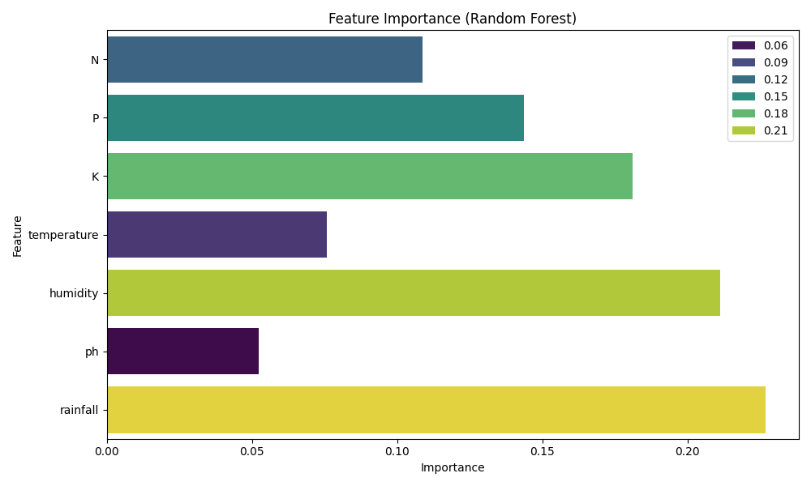
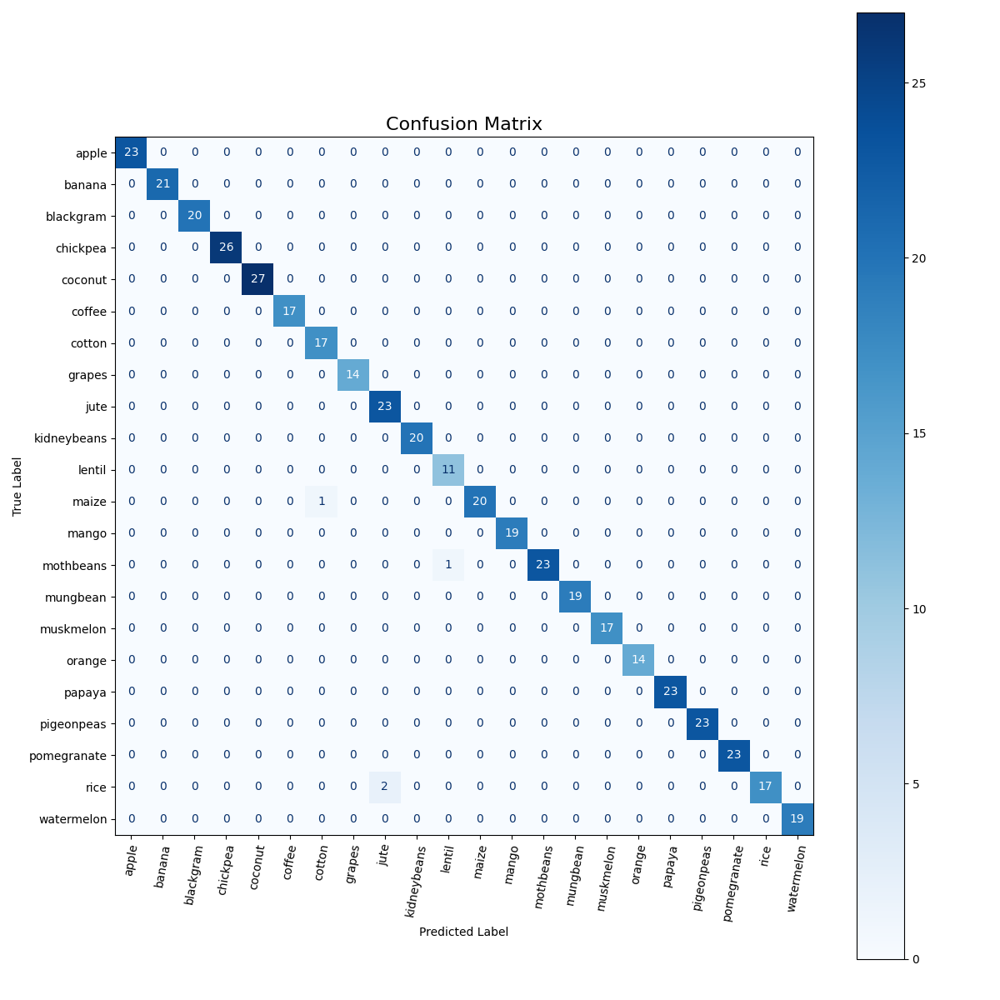

# 🌱 Smart Crop Recommender

Smart Crop Recommender is a machine learning project that recommends the most suitable crop to grow based on environmental and soil data such as nitrogen, phosphorus, potassium, temperature, humidity, pH, and rainfall.

## 📊 Dataset
- **Source:** [Kaggle - Crop Recommendation Dataset](https://www.kaggle.com/datasets/atharvaingle/crop-recommendation-dataset)
- Place the downloaded CSV file in the `data/` directory as `Crop_recommendation.csv`.

## 🚀 Features
- Exploratory Data Analysis (EDA) and visualization
- Stacking ensemble model for crop recommendation
- Model evaluation and feature importance analysis
- Model and label encoder saved for deployment
- Streamlit web app for user-friendly crop recommendation

## 🏗️ Project Structure
```
├── app.py                  # Streamlit web app (deployment)
├── train.py                # Model training script
├── requirements.txt        # Python dependencies
├── data/                   # Dataset storage
│   └── Crop_recommendation.csv
├── models/                 # Saved models and encoders
│   ├── smart_crop_recommender.pkl
│   └── label_encoder.pkl
├── notebook/               # Jupyter notebook for EDA and prototyping
│   └── smart-crop-recommender.ipynb
├── visuals/                # Plots and visualizations
│   ├── confusion_matrix.png
│   └── feature_importance.png
└── README.md               # Project documentation
```

## 🏃‍♂️ Getting Started
1. **Clone the repository**
2. **Install dependencies**
   ```bash
   pip install -r requirements.txt
   ```
3. **Download the dataset** and place it in the `data/` folder.
4. **Train the model**
   ```bash
   python train.py
   ```
5. **Run the Streamlit app locally**
   ```bash
   streamlit run app.py
   ```

## 🌐 Deployment
The project is deployed and accessible at:
[https://smart-crop-recommender-fttawfjvkvjycemlmz2tyd.streamlit.app/](https://smart-crop-recommender-fttawfjvkvjycemlmz2tyd.streamlit.app/)

## 📒 Notebook
See `notebook/smart-crop-recommender.ipynb` for EDA, model development, and visualizations.

## 🖼️ Sample Visualizations

**Feature Importance**



**Confusion Matrix**



## 📄 License
This project is licensed under the MIT License.
